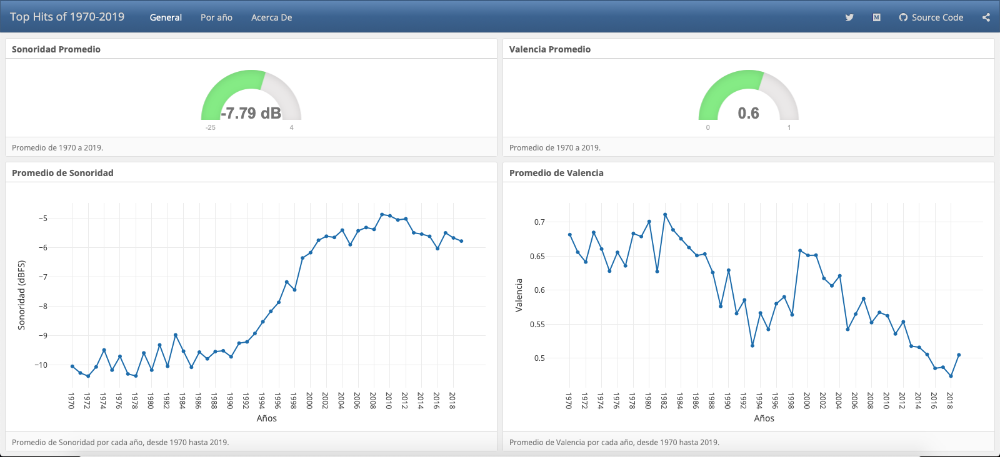
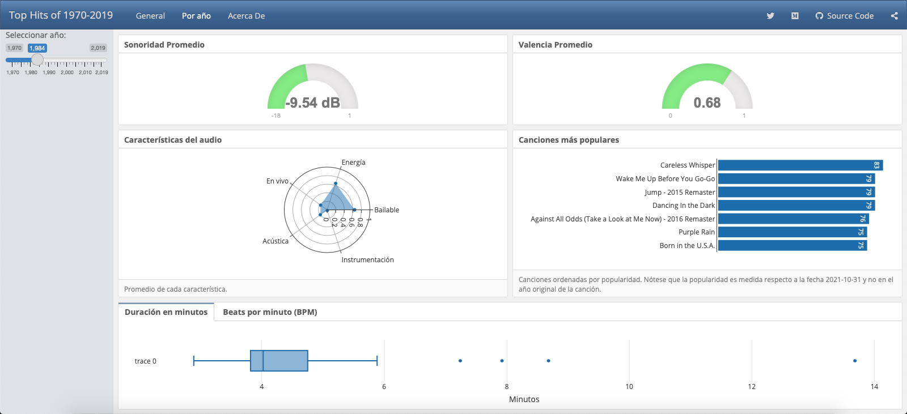

# Dashboard of Top Hits from 1970 to 2019

Repository for a dashboard made with R, using the Flexdashboard and Shiny packages. The whole R code is in the file ```index.Rmd```.

The flexdashboard is made interactive with the Shiny package, it was deployed to ```Shinyapps.io``` and can be found at [https://hugojira.shinyapps.io/TopHits1970-2019/](https://hugojira.shinyapps.io/TopHits1970-2019/).

The **data** was downloaded from the [Spotify Web API](https://developer.spotify.com/documentation/web-api/) with R code using the [Spotifyr](https://www.rcharlie.com/spotifyr/) wrapper. The code and a detail description on the data can be found in this another [GitHub repo](https://github.com/hugojira/TopHits1970-2019).

## Overview

The goal of the dashboard is to show trends in the top hits songs, from 1970 to 2019, specifically for English spoken music. One of the things shown with the plots is the [Loudness War](https://en.wikipedia.org/wiki/Loudness_war), which is quantified by the decibels relative to full scale (dBFS).

The **dashboard** has the next two pages to show visualizations


 
-----------------------------------------

